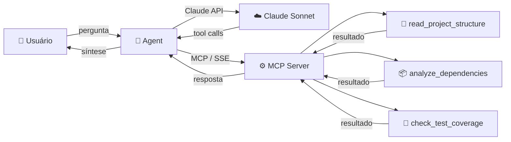

# 🔍 Dev-Lens

**Analisador de projetos Java via linguagem natural, powered by Spring AI + MCP**

Aponte para qualquer projeto Java, faça perguntas no terminal, e receba análises detalhadas sobre estrutura, dependências e cobertura de testes — tudo orquestrado por IA.

---

## 💬 Exemplo de Uso

```
========================================
        Dev-Lens v0.0.1
  Analisador de Projetos Java via IA
========================================

dev-lens> analisa a estrutura do projeto em C:/projects/astrolog-api
Analisando...

O projeto AstroLog API segue o padrão MVC:
  • controller/ → 1 classe (ObservationController)
  • service/    → 3 classes (CelestialBodyService, ObservationService, AlertService)
  • repository/ → 1 classe (CelestialBodyRepository)
  • model/      → 2 classes (CelestialBody, Observation)

dev-lens> tem alguma vulnerabilidade?
Analisando...

⚠️ 2 vulnerabilidades encontradas:
  • log4j-core 2.14.1 — CVE-2021-44228 (Log4Shell) — CRITICAL
  • commons-text 1.9  — CVE-2022-42889 (Text4Shell) — HIGH

dev-lens> qual a cobertura de testes?
Analisando...

Cobertura geral: 66.7% (abaixo do threshold de 80%)
3 classes abaixo do threshold:
  • AlertService          — 30.0%
  • ObservationService    — 45.0%
  • ObservationController — 77.8%

dev-lens> sair
Encerrando Dev-Lens. Até mais!
```

---

## ⚙️ Como Funciona



**Fluxo completo:**

1. Usuário digita uma pergunta no terminal
2. O Agent envia para a **Claude API** via Spring AI
3. Claude analisa e decide quais **tools MCP** chamar
4. Spring AI invoca as tools no **MCP Server** via SSE
5. O MCP Server executa (percorre arquivos, parseia XML, consulta APIs)
6. Resultado volta para Claude, que **sintetiza a resposta**
7. Usuário lê a análise no terminal

---

## 🛠️ As 3 Tools

| Tool | O que faz | Fontes de dados |
|---|---|---|
| `read_project_structure` | Percorre o projeto e detecta o padrão arquitetural (MVC, Hexagonal, Clean Architecture) | Sistema de arquivos |
| `analyze_dependencies` | Lê o `pom.xml`, verifica versões desatualizadas e vulnerabilidades (CVEs) | Maven Central API + OSV.dev |
| `check_test_coverage` | Parseia o relatório JaCoCo e identifica classes com cobertura abaixo do threshold | `jacoco.xml` |

### `read_project_structure`

Mapeia a árvore de pacotes do projeto e identifica o padrão arquitetural com base nos nomes:

- `controller/service/repository` → **MVC**
- `domain/ports/adapters` → **Hexagonal (Ports & Adapters)**
- `presentation/domain/data` → **Clean Architecture**

### `analyze_dependencies`

Extrai dependências do `pom.xml`, resolve properties (`${guava.version}` → `31.0-jre`), e para cada uma:

- Consulta a **Maven Central Search API** para verificar a versão mais recente
- Consulta a **OSV.dev API** para buscar vulnerabilidades conhecidas (CVE ID + severidade)

### `check_test_coverage`

Parseia o XML do JaCoCo com cobertura por instrução, branch e linha. Identifica classes abaixo de um threshold configurável (padrão: 80%) e gera um resumo para o agente sintetizar.

---

## 🧰 Stack Tecnológica

| Tecnologia | Versão | Papel |
|---|---|---|
| **Java** | 25 | Linguagem base |
| **Spring Boot** | 4.0.5 | Framework dos módulos |
| **Spring AI** | 2.0.0-M3 | Orquestração do agente + MCP Client |
| **Spring MCP Server** | 2.0.0-M3 | Exposição de tools via protocolo MCP |
| **Claude API** | Sonnet | Modelo de linguagem |
| **Docker Compose** | — | Orquestração dos containers |
| **Maven** | — | Build e gerenciamento de dependências |

---

## 🚀 Quick Start

### Pré-requisitos

- Java 25+
- Maven 3.9+
- API Key da Anthropic ([console.anthropic.com](https://console.anthropic.com))

### Opção 1: Dev Local

```bash
# Terminal 1 — subir o MCP Server
./mvnw -pl mcp-server spring-boot:run

# Terminal 2 — subir o Agent
export ANTHROPIC_API_KEY=sk-ant-xxx    # Linux/Mac
set ANTHROPIC_API_KEY=sk-ant-xxx       # Windows

./mvnw -pl agent spring-boot:run
```

### Opção 2: Docker Compose

```bash
export ANTHROPIC_API_KEY=sk-ant-xxx
docker compose up --build
```

### Testar com o Sample Project

O repositório inclui um projeto Java de exemplo (`sample-project/`) com dependências propositalmente vulneráveis e cobertura de testes variada:

```
dev-lens> analisa a estrutura do projeto em ./sample-project
dev-lens> tem alguma dependência desatualizada? ./sample-project
dev-lens> qual a cobertura de testes? ./sample-project
```

---

## 📁 Estrutura do Projeto

```
dev-lens/
├── mcp-server/              → MCP Server — expõe as 3 tools via SSE
│   ├── tool/                → Services das tools (@Tool)
│   ├── model/               → DTOs (Java Records)
│   ├── client/              → Clients REST (Maven Central, OSV.dev)
│   └── config/              → Configuração do MCP Server
├── agent/                   → Agent CLI — REPL interativo
│   ├── config/              → ChatClient + System Prompt
│   └── cli/                 → CommandLineRunner (loop REPL)
├── sample-project/          → Projeto Java de exemplo (AstroLog API 🔭)
│   ├── pom.xml              → Deps propositalmente vulneráveis
│   └── target/jacoco/       → Relatório de cobertura pré-gerado
└── docker-compose.yml       → Orquestra mcp-server + agent
```

---

## 🎯 Por que é forte no portfólio

| Sinal | O que demonstra |
|---|---|
| **MCP Server em Java** | Conhecimento de protocolo atual, não só uso de LLM |
| **Spring Boot 4 + Spring AI** | Stack mais moderna do ecossistema Java em 2026 |
| **Tool design** | Capacidade de pensar em interfaces para agentes de IA |
| **DevTools domain** | Maturidade — você constrói ferramentas para outros devs |
| **Roda 100% local** | Entende custos e privacidade em soluções com IA |

---

## 🔧 Detalhes Técnicos

Decisões de implementação que valem destaque:

- **Parsing de XML nativo** — usa `DocumentBuilder` do JDK, sem dependências externas para ler POM e JaCoCo
- **DTD desabilitada** no parser XML — evita falhas em ambientes offline (`load-external-dtd = false`)
- **`extractDirectCounter`** — itera filhos diretos do XML via `getChildNodes()`, não `getElementsByTagName`, para evitar contagem recursiva incorreta
- **Resolução de properties do Maven** — trata `${placeholder}` no POM antes de consultar versões
- **Validação de CVEs via OSV.dev** — API pública e gratuita, sem necessidade de API key
- **Verificação de versões via Maven Central Search API** — compara versão local vs. última disponível
- **`Optional<ToolCallbackProvider>`** — ChatClient funciona com ou sem MCP ativo (graceful degradation)
- **`@ConditionalOnProperty`** — REPL desabilitável para testes automatizados

---

## 🧪 Testes

```bash
# Rodar todos os testes
./mvnw clean test

# Apenas o MCP Server (19 testes)
./mvnw -pl mcp-server test

# Apenas o Agent (1 teste)
./mvnw -pl agent test
```

| Módulo | Testes | Cobertura |
|---|---|---|
| `mcp-server` | 19 | `ProjectStructureService`, `DependencyAnalysisService`, `TestCoverageService`, Context |
| `agent` | 1 | Context load (MCP Client desabilitado no profile de teste) |

---

## 📋 Como apontar para um projeto

**Via pergunta direta:**
```
dev-lens> analisa o projeto em C:/meu-projeto
```

**Via variável de ambiente:**
```bash
export DEV_LENS_PROJECT=C:/meu-projeto
# Agora basta perguntar sem informar o path:
dev-lens> tem alguma dependência desatualizada?
```
